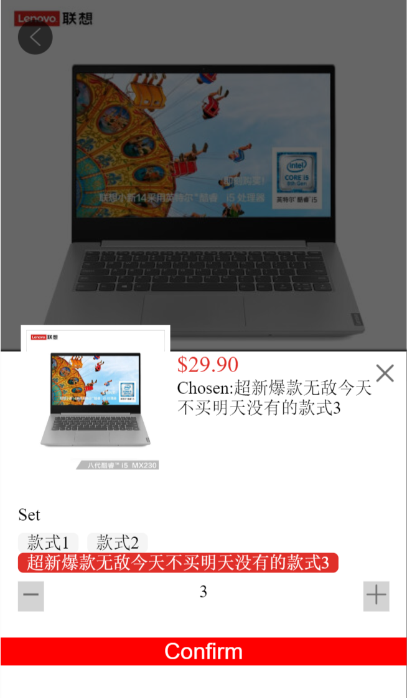

# group-buying-website

**The front-end of a group-buying website built with Angular.**

#
If you are also interested in Angular like me, just don't miss this project. It is a good start-up to get into Angular. You can fork this project and I appreciate your star.
[Find more in my blog.](https://tongshi049.github.io/)

#

## Overview

- Designing multiple Angular ***Modules***, ***Components***, ***Routers***, ***Services***, as well as customized ***Directives***, ***Pipes***.
- Using ***rxjs*** to deat with asynchronous codes. 
- ***Mobile***, ***Flex & Grid layout***, ***Responsive Design***, ***Observer & Observable***.

#

## Project Snapshot

1. **Project Conclustion**:
<div>
  
</div>
<br> 

2. The **Home Page**: 
<div>
  
</div>
<br>

3. The **Recommend Page**:
<div>
  
</div>
<br>

4. The **Account Page**: 
<div>
  
</div>
<br>

5. The **Product Page**:
<div>
  
</div>
<br>

6. The **Product Dialog Page**:
<div>
  
</div>
<br>

7. The **Order Page**:
<div>
  
</div>
<br>

#

## Getting Started

- Go the project folder and install dependencies
```
npm install
``` 
- Launch development server, and open `localhost:4200` in your browser
```
ng s
```

#

## Project Structure

```
dist/                        compiled version
e2e/                         end-to-end tests
src/                         project source code
|- app/                      app components
|  |- product/               product module (singleton services and single-use components)
|  |- shared/                shared module  (common components, directives and pipes)
|  |- app.component.*        app root component (shell)
|  |- app.module.ts          app root module definition
|  |- app-routing.module.ts  app routes
|  +- ...                    additional modules and components
|- assets/                   app assets (images, fonts, sounds...)
|- environments/             values for various build environments
|- index.html                html entry point
|- styles.css                global styles
|- main.ts                   app entry point
|- polyfills.ts              polyfills needed by Angular
|- angular.json              config of Angular
|- package.json              npm packages
|- tslint.json               config of typescript
|- ...                       addtional files
```

#

## Code Scaffolding

Tasks are mostly based on `angular-cli`tool. Use `ng help` or check the [Angular-CLI](https://cli.angular.io/).

#

### devDependencies

- "@angular-devkit/build-angular": "~0.13.0",
- "@angular/cli": "~7.3.5",
- "karma": "~4.0.0",
- "tslint": "~5.11.0"
- "typescript": "~3.2.2"

#

### Libraries

- [Angular](https://angular.io/).
- [RxJs](https://rxjs-dev.firebaseapp.com/).
- [typescript](https://www.typescriptlang.org/).
- [ES6](https://es6.io/).


